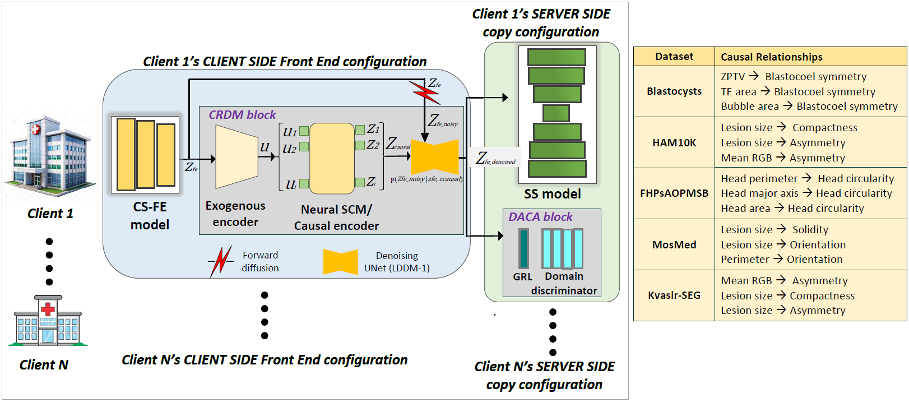

# MuCALD_SplitFed

This is the official code repository of the paper **"MuCALD-SplitFed: Causal-Latent Diffusion for Privacy-Preserving Multi-Task Split-Federated Medical Image Segmentation."**

---

## Overview

MuCALD-SplitFed is a **multi-task Split Federated Learning (SplitFed)** framework that integrates **causal representation learning** and **latent diffusion** to enable stable, privacy-preserving, and accurate medical image segmentation across heterogeneous institutions and tasks.

Unlike standard FL/ SplitFed, which usually assume a single shared task and become unstable in realistic multi-task settings, MuCALD-SplitFed:

- learns **causal latent factors** that capture task-relevant structure,
- injects and denoises **diffusion noise** at split points to obfuscate private information,
- uses **domain-adversarial alignment** to suppress domain-specific leakage and improve cross-task generalization.

Experiments on five heterogeneous medical segmentation datasets show that the baseline SplitFed tends to be unstable or fails to converge in multi-task settings, whereas MuCALD-SplitFed achieves **consistent performance gains** and **stronger privacy resilience** against reconstruction attacks.

---

## Key Contributions

MuCALD-SplitFed has the following key contributions:

1. **Causal modelling in SplitFed latent space**  
   First framework to integrate causal representation learning directly at the SplitFed split points for multi-task medical segmentation.

2. **Causal Representation & Diffusion Module (CRDM)**  
   - Exogenous encoder + Neural Structural Causal Model (Neural-SCM)  
   - Latent diffusion with denoising UNet (LDDM) to inject and remove noise while preserving causal structure.

3. **Domain-Adversarial Causal Alignment (DACA)**  
   - Gradient Reversal Layer (GRL) and domain discriminator for cross-client/domain invariance and reduced domain-specific leakage.

4. **Empirical validation on 5 clients/ datasets**  
   - Blastocysts, HAM10K, FHPsAOPMSB, MosMed, and Kvasir-SEG, demonstrating improved segmentation metrics and degraded reconstruction quality at split points compared to Baseline SplitFed and strong personalized / multi-task FL baselines.

---

## Installation

Create and activate environment
```bash
conda create -n mucald_splitfed python=3.9 -y
conda activate mucald_splitfed
```

Install the requirements
```bash
pip install -r requirements.txt
```
## Datasets
We used following 5 datasets.
1. Blastocyst dataset
2. HAM10K dataset
3. FHPsAOPMSB dataset
4. Mosmed Dataset
5. Kvasir-SEG dataset 

## Model Components
Following is the system architecture. 



The proposed architecture contains 3 major components.
1. Causal Representation and Diffusion Module (CRDM)
2. Domain-Adversarial Causal Alignment (DACA)

## Citation